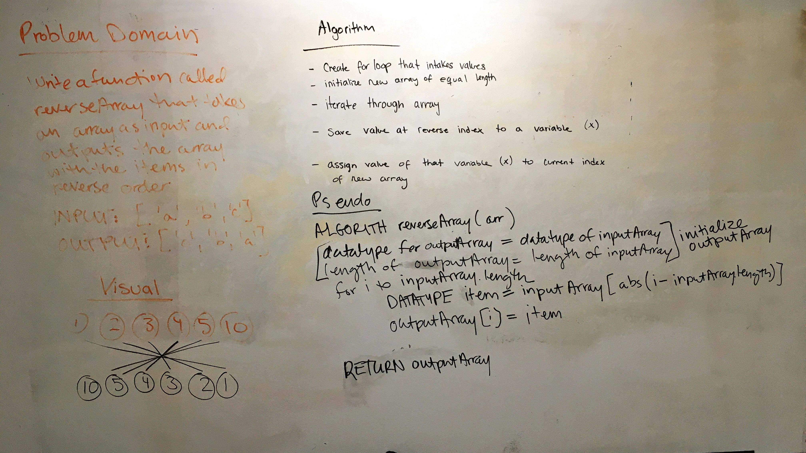

# Code Challenges

I build an app with a direct and powerful purpose. It does all of the things that it accomplishes well. I should describe the purpose and functionality so those that visit my README understand the app

### Author: Ellen Conley

## Code 401 Challenges

### Code Challenge 01

#### Whiteboard

#### Links and Resources
* [submission PR 1](https://github.com/egconley/data-structures-and-algorithms/pull/35)
* [submission PR 2](https://github.com/egconley/data-structures-and-algorithms/pull/35)

## Code 301 Challenges

#### Links and Resources
* [submission PR](http://xyz.com)
* Any Links you used as reference

#### Setup

##### `.env` requirements
* `PORT` - Port Number
* `DATABASE_URL` - URL to the running mongo instance/db
* any environment variables like api keys as needed

##### Running the app
* `npm start`
* Endpoint: `/foo/bar/`
  * Returns a JSON object with abc in it.
* Endpoint: `/bing/zing/`
  * Returns a JSON object with xyz in it.

#### Reflections and Comments
* Consider including the answers to your daily journal and submission questions here
* This is also a good place to reflect on the tools and resources used and learned
