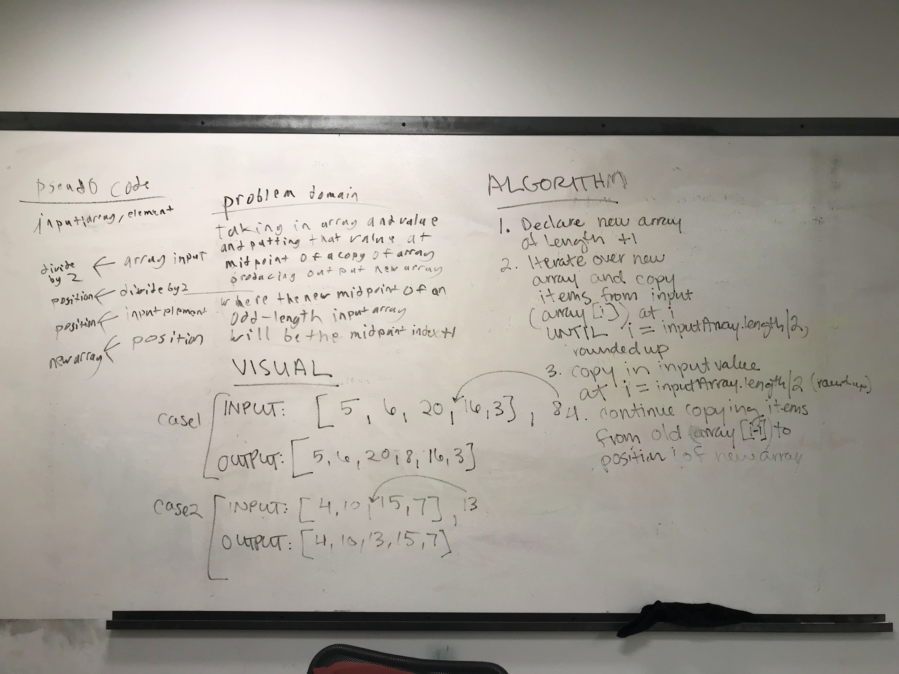
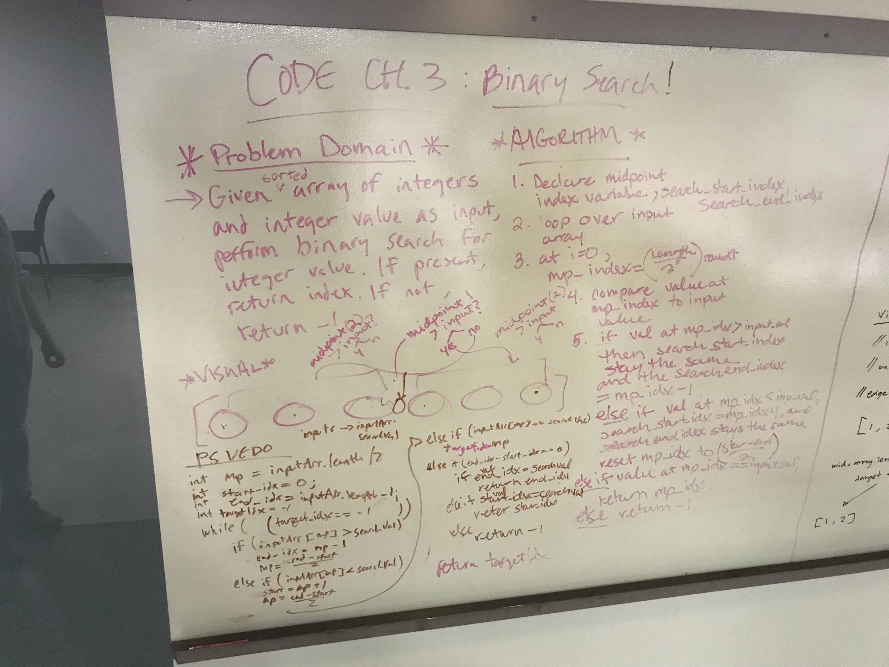

# Code Challenges

I built an app with a direct and powerful purpose. It does all of the things that it accomplishes well. I should describe the purpose and functionality so those that visiters to my README understand the app

### Author: Ellen Conley

## Table of Contents
- Code Challenge 01: Reverse an array
- Code Challenge 02: Insert and shift an array in middle at index
- Code Challenge 03: Binary search in a sorted 1D array

## Code 401 Challenges

## Code Challenge 01
[link to code](https://github.com/egconley/data-structures-and-algorithms/blob/master/code401challenges/src/main/java/code401challenges/ArrayReverse.java)

### Challenge Summary
Reverse an array.

### Challenge Description
Write a function called reverseArray which takes an array as an argument. Without utilizing any of the built-in methods available to your language, return an array with elements in reversed order.

### Approach & Efficiency


### Solution


* [submission PR 1](https://github.com/egconley/data-structures-and-algorithms/pull/35)
* [submission PR 2](https://github.com/egconley/data-structures-and-algorithms/pull/35)

## Code Challenge 02
[link to code](https://github.com/egconley/data-structures-and-algorithms/blob/master/code401challenges/src/main/java/code401challenges/ArrayShift.java)

### Challenge Summary
Insert and shift an array in middle at index

### Challenge Description
Write a function called insertShiftArray which takes in an array and the value to be added. Without utilizing any of the built-in methods available to your language, return an array with the new value added at the middle index.

### Approach & Efficiency

1. Create a new int array of length +1
2. Loop over new int array, inserting values from input array until i is half the length of the input array.
  - if the input array is an even-length array, insert input value at i.  Continue inserting values from input array[i-1] at i of new array.
  - if the input array is an odd-length array, insert value from old array at i, AND insert the input value at i+1.  At indexes greater than i+1, insert values from input array[i-1]
    
### Solution


* [submission PR 1](https://github.com/egconley/data-structures-and-algorithms/pull/39)

```
    public static int[] insertShiftArray(int[] array, int value) {
        int[] newArray = new int[array.length +1];

        for (int i=0; i < newArray.length; i++) {
            if ( i < (array.length/2) ) {
                newArray[i] = array[i];
            } else if (i == (int) Math.ceil(array.length/2) && array.length %2 == 0) {
                newArray[i] = value;
            } else if (i == (int) Math.ceil(array.length/2) && array.length %2 != 0) {
                newArray[i] = array[i];
                newArray[i+1] = value;
            } else if (i > array.length/2 && array.length %2 == 0) {
                newArray[i] = array[i-1];
            } else if (i > (array.length/2 + 1) && array.length %2 != 0) {
                newArray[i] = array[i-1];
            }
        }
        System.out.println("newArray: " + Arrays.toString(newArray) );
        return newArray;
    }
```

## Code Challenge 03
[link to code](https://github.com/egconley/data-structures-and-algorithms/blob/master/code401challenges/src/main/java/code401challenges/BinarySearch.java)

### Challenge Summary
Binary search in a sorted 1D array

### Challenge Description
Write a function called BinarySearch which takes in 2 parameters: a sorted array and the search key. Without utilizing any of the built-in methods available to your language, return the index of the array’s element that is equal to the search key, or -1 if the element does not exist.

### Approach & Efficiency

1. Declare a method binarySearch() that takes in an int array and an integer (target value).
2. Declare index to begin search and ininitialize as 0.
3. Declare index to end search and initialize as last index of input array.
4. Declare midpoint index and initialize as the sum of (#1 and #2), divided by 2.
5. Declare target index variable and initialize at -1.
6. Declare boolean variable to indicate whether the target value has been found.
7. Loop over input array while boolean foundTarget is false;
   - check if the target value can be found in the following places
      * the midpoint
      * the first index
      * the last index
      * *if so,* foundTarget gets set to the index at that location, and the method returns that index.
   - check if the target value is *less than* the value at the first index or *greater than* the value at the last index
   - *if so,* break out of while loop and return -1.
   - check if the target value *is greater than* the value at the midpoint.
   - *if so,* set the begin search variable to the current midpoint index and find the new midpoint
   - check if the target value *is less than* the value at the midpoint.
   - *if so,* set the end search variable to the current midpoint index and find the new midpoint
 8. Return target index variable
 
 **Efficiency: O(log n)**
    
### Solution


* [submission PR 1](https://github.com/egconley/data-structures-and-algorithms/pull/41)
* [resubmission PR](https://github.com/egconley/data-structures-and-algorithms/pull/42)

```
    public static int binarySearch(int[] array, int value) {
        System.out.println("array: " + Arrays.toString(array) + " target value: " + value);
        int startSearchIdx = 0;
        int endSearchIdx = array.length - 1;
        int target_idx = -1;
        int midpoint = (endSearchIdx + startSearchIdx)/2;

        boolean foundValue = false;

        System.out.println("array: " + array + " target value: " + value);

        System.out.println("mp = " + midpoint + " array[mp]: " + array[midpoint] + " target value: " + value);

        while (foundValue == false) {
            if (array[midpoint] == value) {
              System.out.println("#1 array[mp] == value, array[mp] = " + array[midpoint] + " mp: " + midpoint);
              target_idx = midpoint;
              System.out.println("value found! array[target_idx] = " + array[target_idx]);
              foundValue = true;
            } else if (array[startSearchIdx] == value) {
              target_idx = startSearchIdx;
              System.out.println("#2 value found! array[target_idx] = " + array[target_idx]);
              foundValue = true;
            } else if (array[endSearchIdx] == value) {
                target_idx = endSearchIdx;
                System.out.println("#3 value found! array[target_idx] = " + array[target_idx]);
                foundValue = true;
            } else if (value < array[0] || value > array[array.length -1]){
                System.out.println("#4 value doesn't exist in input array");
                break;
            } else if (array[midpoint] > value) {
                System.out.println("#5 array[mp] > value, array[mp] = " + array[midpoint] + " mp: " + midpoint);
                endSearchIdx = midpoint;

                midpoint = (endSearchIdx + startSearchIdx)/2;
                System.out.println("new mp: " + midpoint);
            } else if (array[midpoint] < value) {
                System.out.println("#6 array[mp] < value, array[mp] = " + array[midpoint] + " mp: " + midpoint);
                startSearchIdx = midpoint;

                midpoint = (endSearchIdx + startSearchIdx)/2;
            } else if ( (endSearchIdx - startSearchIdx) < 0 ) {
                System.out.println("#7 value doesn't exist in input array");
                break;
            }
        }
        System.out.println("output target_idx = " + target_idx);
        return target_idx;
    }
```
