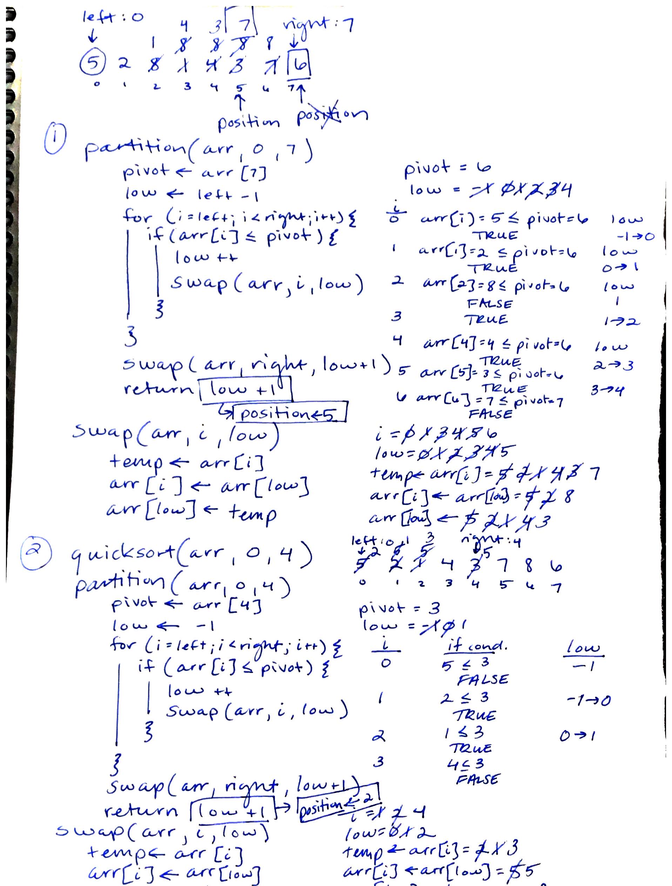

# Code Challenges

Data structures and algorithms practice.

### Author: Ellen Conley

## Table of Contents
- [Code Challenge 01](#code-challenge-01): Reverse an array
- [Code Challenge 02](#code-challenge-02): Insert and shift an array in middle at index
- [Code Challenge 03](#code-challenge-03): Binary search in a sorted 1D array
- [Code Challenge 04](#code-challenge-04): Linked List Implementation
- [Code Challenge 06](#code-challenge-06): Linked list insertions
- [Code Challenge 07](#code-challenge-07): k-th value from the end of a linked list
- [Code Challenge 08](#code-challenge-08): Merge 2 linked lists
- [Code Challenge 10](#code-challenge-10): Stacks and Queues
- [Code Challenge 11](#code-challenge-11): Implement a Queue using two Stacks
- [Code Challenge 12](#code-challenge-12): FIFO animal shelter
- [Code Challenge 13](#code-challenge-13): Multi-bracket Validation
- [Code Challenge 15](#code-challenge-15): Trees Implementation
- [Code Challenge 16](#code-challenge-16): Fizz Buzz Tree
- [Code Challenge 17](#code-challenge-17): Breadth-first Traversal
- [Code Challenge 18](#code-challenge-18): Find the Maximum Value in a Binary Tree
- [Code Challenge 27](#code-challenge-27): Merge Sort
- [Code Challenge 28](#code-challenge-28): Quick Sort
- [Code Challenge 30](#code-challenge-30): Hashtable implementation
- [Code Challenge 31](#code-challenge-31): First Repeated Word in a Book
- [Code Challenge 33](#code-challenge-33): Implement a simplified LEFT JOIN for 2 Hashmaps
- [Code Challenge 34.5](#code-challenge-34.5): Find common values in 2 binary trees.

## Code 401 Challenges

## Code Challenge 01
[link to code](https://github.com/egconley/data-structures-and-algorithms/blob/master/code401challenges/src/main/java/code401challenges/ArrayReverse.java)

### Challenge Summary
Reverse an array.

### Challenge Description
Write a function called reverseArray which takes an array as an argument. Without utilizing any of the built-in methods available to your language, return an array with elements in reversed order.

### Approach & Efficiency


### Solution


* [submission PR 1](https://github.com/egconley/data-structures-and-algorithms/pull/35)
* [submission PR 2](https://github.com/egconley/data-structures-and-algorithms/pull/35)

## Code Challenge 02
[link to code](https://github.com/egconley/data-structures-and-algorithms/blob/master/code401challenges/src/main/java/code401challenges/ArrayShift.java)

### Challenge Summary
Insert and shift an array in middle at index

### Challenge Description
Write a function called insertShiftArray which takes in an array and the value to be added. Without utilizing any of the built-in methods available to your language, return an array with the new value added at the middle index.

### Approach & Efficiency

1. Create a new int array of length +1
2. Loop over new int array, inserting values from input array until i is half the length of the input array.
  - if the input array is an even-length array, insert input value at i.  Continue inserting values from input array[i-1] at i of new array.
  - if the input array is an odd-length array, insert value from old array at i, AND insert the input value at i+1.  At indexes greater than i+1, insert values from input array[i-1]
    
### Solution


* [submission PR 1](https://github.com/egconley/data-structures-and-algorithms/pull/39)

```
    public static int[] insertShiftArray(int[] array, int value) {
        int[] newArray = new int[array.length +1];

        for (int i=0; i < newArray.length; i++) {
            if ( i < (array.length/2) ) {
                newArray[i] = array[i];
            } else if (i == (int) Math.ceil(array.length/2) && array.length %2 == 0) {
                newArray[i] = value;
            } else if (i == (int) Math.ceil(array.length/2) && array.length %2 != 0) {
                newArray[i] = array[i];
                newArray[i+1] = value;
            } else if (i > array.length/2 && array.length %2 == 0) {
                newArray[i] = array[i-1];
            } else if (i > (array.length/2 + 1) && array.length %2 != 0) {
                newArray[i] = array[i-1];
            }
        }
        System.out.println("newArray: " + Arrays.toString(newArray) );
        return newArray;
    }
```

## Code Challenge 03
[link to code](https://github.com/egconley/data-structures-and-algorithms/blob/master/code401challenges/src/main/java/code401challenges/BinarySearch.java)

### Challenge Summary
Binary search in a sorted 1D array

### Challenge Description
Write a function called BinarySearch which takes in 2 parameters: a sorted array and the search key. Without utilizing any of the built-in methods available to your language, return the index of the array’s element that is equal to the search key, or -1 if the element does not exist.

### Approach & Efficiency

1. Declare a method binarySearch() that takes in an int array and an integer (target value).
2. Declare index to begin search and ininitialize as 0.
3. Declare index to end search and initialize as last index of input array.
4. Declare midpoint index and initialize as the sum of (#1 and #2), divided by 2.
5. Declare target index variable and initialize at -1.
6. Declare boolean variable to indicate whether the target value has been found.
7. Loop over input array while boolean foundTarget is false;
   - check if the target value can be found in the following places
      * the midpoint
      * the first index
      * the last index
      * *if so,* foundTarget gets set to the index at that location, and the method returns that index.
   - check if the target value is *less than* the value at the first index or *greater than* the value at the last index
   - *if so,* break out of while loop and return -1.
   - check if the target value *is greater than* the value at the midpoint.
   - *if so,* set the begin search variable to the current midpoint index and find the new midpoint
   - check if the target value *is less than* the value at the midpoint.
   - *if so,* set the end search variable to the current midpoint index and find the new midpoint
 8. Return target index variable
 
 **Efficiency: O(log n)**
    
### Solution


* [submission PR 1](https://github.com/egconley/data-structures-and-algorithms/pull/41)
* [resubmission PR](https://github.com/egconley/data-structures-and-algorithms/pull/42)

```
public static int binarySearch(int[] arr, int n) {
        if (arr == null || arr.length == 0) {
            return -1;
        } else {

            int leftIdx = 0;
            int rightIdx = arr.length - 1;
            int mpIdx = (rightIdx + leftIdx) / 2;
            int mpValue = arr[mpIdx];

            boolean found = (mpValue == n || (arr[leftIdx] == n) || (arr[rightIdx] == n));
            int nIdx = -1;

            if (mpValue==n) {
                nIdx = mpIdx;
            } else if (arr[rightIdx]==n) {
                nIdx = rightIdx;
            } else if (arr[leftIdx]==n) {
                nIdx = leftIdx;
            }

            while (!found && leftIdx != mpIdx && rightIdx != mpIdx) {
                if (mpValue > n) {
                    rightIdx = --mpIdx;

                } else if (mpValue < n) {
                    leftIdx = ++mpIdx;
                }

                mpIdx = (rightIdx + leftIdx) / 2;
                mpValue = arr[mpIdx];
                found = (mpValue == n || (arr[leftIdx] == n) || (arr[rightIdx] == n));

                if (mpValue==n) {
                    nIdx = mpIdx;
                } else if (arr[rightIdx]==n) {
                    nIdx = rightIdx;
                } else if (arr[leftIdx]==n) {
                    nIdx = leftIdx;
                }
            }

            return nIdx;

        }
```

## Code Challenge 04
[link to code](https://github.com/egconley/data-structures-and-algorithms/tree/master/code401challenges/src/main/java/code401challenges/linkedlist)

### Challenge Summary
Implement a singly-linked list
  
### Solution


* [submission PR](https://github.com/egconley/data-structures-and-algorithms/pull/43)

### Resources
[Absolute Java, by Walter Savitch - Chapter 15](https://www.csie.ntu.edu.tw/~cyy/courses/oop/13summer/chap15java5th.pdf)

## Code Challenge 06
[link to code](https://github.com/egconley/data-structures-and-algorithms/tree/master/code401challenges/src/main/java/code401challenges/linkedlist)

### Challenge Summary
- .append(value) which adds a new node with the given value to the end of the list
- .insertBefore(value, newVal) which add a new node with the given newValue immediately before the first value node
- .insertAfter(value, newVal) which add a new node with the given newValue immediately after the first value node
  
### Solution


* [submission PR](https://github.com/egconley/data-structures-and-algorithms/pull/44)

```
    public void append(String itemName, int itemCount) {
        Node newNode = new Node(itemName, itemCount, null);
        Node position = head;
        if (position == null) {
            insert(itemName, itemCount);
        } else {
            String itemAtPosition;
            while (position.getLink() != null) {
                itemAtPosition = position.getItem();
                position = position.getLink();
                System.out.println("ItemAtPosition: " + itemAtPosition);
            }
            position.setLink(newNode);
        }
    }

    public void insertAfter(String item, int newItemCount, String newItemName) {
        Node newNode = new Node(newItemName, newItemCount, null);
        Node position = head;
        String itemAtPosition;
        Node nextNode = position.getLink();
        while(!position.getItem().equals(item)) {
            itemAtPosition = position.getItem();
            position = position.getLink();
            itemAtPosition = position.getItem();
            nextNode = position.getLink();
        }
        position.setLink(newNode);
        newNode.setLink(nextNode);
    }

    public void insertBefore(String item, int newItemCount, String newItemName) {
        Node newNode = new Node(newItemName, newItemCount, null);
        Node position = head;
        String itemAtPosition;
        Node nextNode = position.getLink();
        while(!nextNode.getItem().equals(item)) {
            itemAtPosition = position.getItem();
            position = position.getLink();
            itemAtPosition = position.getItem();
            nextNode = position.getLink();
        }
        position.setLink(newNode);
        newNode.setLink(nextNode);
    }
```

### Resources
[Absolute Java, by Walter Savitch - Chapter 15](https://www.csie.ntu.edu.tw/~cyy/courses/oop/13summer/chap15java5th.pdf)

## Code Challenge 07
[link to code](https://github.com/egconley/data-structures-and-algorithms/tree/master/code401challenges/src/main/java/code401challenges/linkedlist)

### Challenge Summary
- method for the Linked List class which takes a number, k, as a parameter and returns the node’s value that is k from the end of the linked list. 
  
### Solution


* [submission PR](https://github.com/egconley/data-structures-and-algorithms/pull/47)

```
    public String getKthFromEnd(int k) {
        int size = 0;
        Node position = head;
        while (position != null) {
            size++;
            position = position.getLink();
        }

        if (k >= size || 0 > k) {
            throw new IndexOutOfBoundsException();
        } else {
            int iterationsToTarget = size - k;
            position = head;
            while ( iterationsToTarget > 1 ) {
                iterationsToTarget--;
                position = position.getLink();
            }
        }
        return position.getItem();
    }
```
## Code Challenge 08

### Challenge Summary
- Merge two linked lists. 

### Approach & Efficiency

1. Declare a method binarySearch() that takes in an int array and an integer (target value).
2. Declare index to begin search and ininitialize as 0.
3. Declare index to end search and initialize as last index of input array.
4. Declare midpoint index and initialize as the sum of (#1 and #2), divided by 2.
5. Declare target index variable and initialize at -1.
6. Declare boolean variable to indicate whether the target value has been found.
7. Loop over input array while boolean foundTarget is false;
   - check if the target value can be found in the following places
      * the midpoint
      * the first index
      * the last index
      * *if so,* foundTarget gets set to the index at that location, and the method returns that index.
   - check if the target value is *less than* the value at the first index or *greater than* the value at the last index
   - *if so,* break out of while loop and return -1.
   - check if the target value *is greater than* the value at the midpoint.
   - *if so,* set the begin search variable to the current midpoint index and find the new midpoint
   - check if the target value *is less than* the value at the midpoint.
   - *if so,* set the end search variable to the current midpoint index and find the new midpoint
 8. Return target index variable
 
 **Efficiency: O(log n)**
  
### Solution


* [submission PR](https://github.com/egconley/data-structures-and-algorithms/pull/48)

## Code Challenge 10

### Challenge Summary
- Implement and Stack and Queue from scratch.
  
### Solution
[link to code](https://github.com/egconley/data-structures-and-algorithms/tree/master/code401challenges/src/main/java/code401challenges/stacksandqueues)

* [submission PR](https://github.com/egconley/data-structures-and-algorithms/pull/49)

## Code Challenge 11

### Challenge Summary
- Implement a Queue using two Stacks.

### Approach & Efficiency

1. Declare a Stack called front.
2. Declare a Stack called back.
3. Enqueue method: 
    1. Take in a value parameter
    2. Use the push method to add the value to the Stack called "back"
4. Dequeue method:
    1. while back.peek() is not null:
        - pop values off of "back" and push them onto "front"
    2. once back.peek() is null, pop top value off of "front" and return it.
 
 **Efficiency: O(n)**
  
### Solution

[link to code](https://github.com/egconley/data-structures-and-algorithms/tree/master/code401challenges/src/main/java/code401challenges/stacksandqueues)


```
public class PseudoQueue<T> {

    Stack<T> front = new Stack<>();
    Stack<T>  back = new Stack<>();

    T value;

    public void enqueue(T value) {
        back.push(value);
    }

    public T dequeue() {
        while (!back.toString().equals("NULL")) {
            front.push(back.pop());
        }
        //System.out.println(front.pop());
        return front.pop();
    }
}
```

* [submission PR](https://github.com/egconley/data-structures-and-algorithms/pull/52)

## Code Challenge 12

### Challenge Summary
First-in, First out Animal Shelter.

### Solution
[link to code](https://github.com/egconley/data-structures-and-algorithms/tree/master/code401challenges/src/main/java/code401challenges/utilities)


```
public class AnimalShelter<T> {

    Queue<Cat> cats;
    Queue<Dog> dogs;
    String pref;

    public AnimalShelter() {
        this.cats = new Queue<>();
        this.dogs = new Queue<>();
    }

    public void shelterEnqueue(Cat cat) {
        cats.enqueue(cat);
    }

    public void shelterEnqueue(Dog dog) {
        dogs.enqueue(dog);
    }

    public Animal shelterDequeue(String pref) {
        if (pref == "cat" && !cats.isEmpty()) {
            return cats.dequeue();
        } else if (pref == "dog" && !dogs.isEmpty()) {
            return dogs.dequeue();
        } else return null;
    }
}
```

* [submission PR](https://github.com/egconley/data-structures-and-algorithms/pull/60)

## Code Challenge 13

### Challenge Summary
Multi-bracket Validation.

### Solution
[link to code](https://github.com/egconley/data-structures-and-algorithms/blob/master/code401challenges/src/main/java/code401challenges/utilities/MultiBracketValidation.java)


```
public class MultiBracketValidation {

    // https://github.com/codefellows/seattle-java-401d9/blob/master/class-14/brackets/Brackets.java
    private static HashMap<Character, Character> bracketMap;
    static {
        bracketMap = new HashMap<>();
        bracketMap.put('(', ')');
        bracketMap.put('[', ']');
        bracketMap.put('{', '}');
        bracketMap.put('<', '>');
    }

    public static boolean validate(String brackets) {

        boolean isBalanced = false;
        LinkedList<Character> bracketStack = new LinkedList<>();

        for(int i = 0; i < brackets.length(); i++) {

            char current = brackets.charAt(i);

            // handle opening brackets
            if (bracketMap.containsKey(current)) {

                bracketStack.push(current);

            // handle closing brackets
            } else if (bracketMap.containsValue(current)) {

                if (!bracketStack.isEmpty()) {

                    char openBracket = bracketStack.pop();

                    if (current == bracketMap.get(openBracket).charValue()) {
                        isBalanced = true;
                    } else {
                        isBalanced = false;
                    }
                }
            }
        }
        return isBalanced;
    }
}
```

* [submission PR](https://github.com/egconley/data-structures-and-algorithms/pull/60)

## Code Challenge 15

### Challenge Summary
Binary Tree and BST Implementation

### Solution
[link to code](https://github.com/egconley/data-structures-and-algorithms/tree/master/code401challenges/src/main/java/code401challenges/tree)

* [submission PR](https://github.com/egconley/data-structures-and-algorithms/pull/57)

## Code Challenge 16

### Challenge Summary
Fizz Buzz Tree

### Efficiency
 
 **Efficiency: O(n)**
 
### Solution

[link to code](https://github.com/egconley/data-structures-and-algorithms/blob/master/code401challenges/src/main/java/code401challenges/utilities/FizzBuzzTree.java)


```
public class FizzBuzzTree {

    public Tree<String> fizzBuzzTree(Tree<Integer> intTree) {
        Node<String> answerRoot = fizzBuzzHelper(intTree.getRoot());
        return new Tree<>(answerRoot);
    }

    public Node<String> fizzBuzzHelper(Node<Integer> curr) {

        if (curr!=null) {
            Node<String> ansNode = new Node<>();
            if (curr.value%15==0) {
                ansNode.value = "FizzBuzz";
            } else if (curr.value%3==0) {
                ansNode.value = "Fizz";
            } else if (curr.value%5==0) {
                ansNode.value = "Buzz";
            } else {
                ansNode.value = curr.value.toString();
            }

            ansNode.left = fizzBuzzHelper(curr.left);
            ansNode.right = fizzBuzzHelper(curr.right);

            return ansNode;

        } else return null;
    }
}
```

* [submission PR](https://github.com/egconley/data-structures-and-algorithms/pull/63

## Code Challenge 17

### Challenge Summary
Breadth-first Traversal
### Solution


* [submission PR](https://github.com/egconley/data-structures-and-algorithms/pull/59)

## Code Challenge 18

### Challenge Summary
Find the Maximum Value in a Binary Tree
### Solution


* [submission PR](https://github.com/egconley/data-structures-and-algorithms/pull/62)

## Code Challenge 27

### Challenge Summary
Trace Merge Sort and implement code
### Solution


* [submission PR](https://github.com/egconley/data-structures-and-algorithms/pull/67)

## Code Challenge 28

### Challenge Summary
Trace Quick Sort and implement code
### Solution



## Code Challenge 30

### Challenge Summary
Implement a hashtable from scrach, including the following methods:
- add: takes in both the key and value, hashes the key, and adds the key and value pair to the table, handling collisions as needed
- get: akes in the key and returns the value from the table
- contains: takes in the key and returns a boolean, indicating if the key exists in the table already
- hash: takes in an arbitrary key and returns an index in the collection
### Solution

* [submission PR](https://github.com/egconley/data-structures-and-algorithms/pull/70)

### Resources
[Introduction to Programming Using Java
Version 4.1](http://math.hws.edu/eck/cs124/javanotes4/c12/ex-12-3-answer.html)

## Code Challenge 31

### Challenge Summary
Find the first repeated word in a book.
### Solution


* [submission PR](https://github.com/egconley/data-structures-and-algorithms/pull/73)
* [link to code](./code401challenges/src/main/java/code401challenges/RepeatedWord)

## Code Challenge 33

### Challenge Summary
Implement a simplified LEFT JOIN for 2 Hashmaps.
### Solution


* [submission PR](https://github.com/egconley/data-structures-and-algorithms/pull/74)
* [link to code](./code401challenges/src/main/java/code401challenges/LeftJoin)

## Code Challenge 33

### Challenge Summary
Implement a simplified LEFT JOIN for 2 Hashmaps.
### Solution


* [submission PR](https://github.com/egconley/data-structures-and-algorithms/pull/75)
* [link to code](./code401challenges/src/main/java/code401challenges/tree/TreeIntersection)
